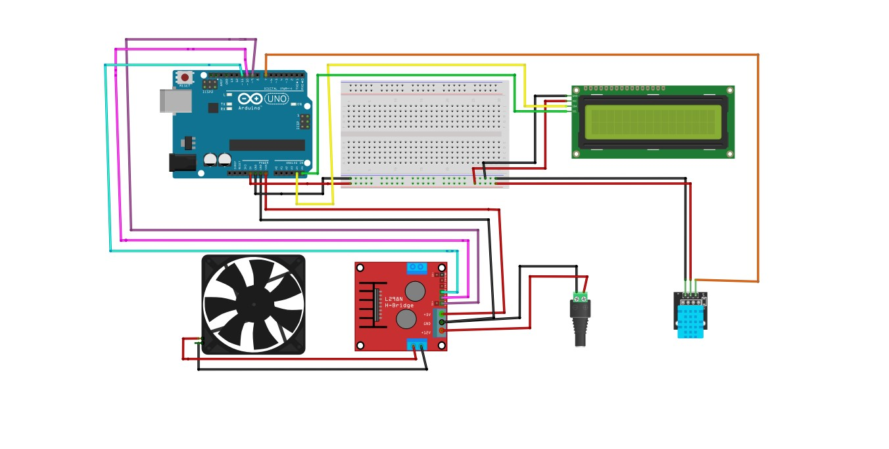
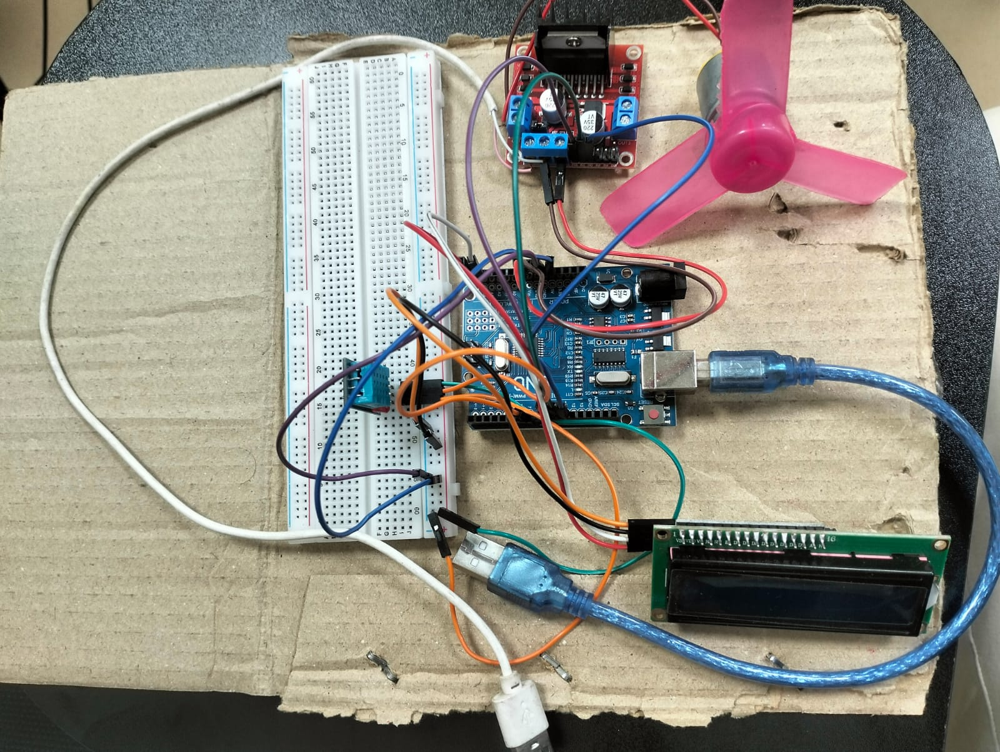
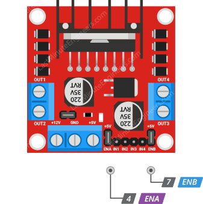
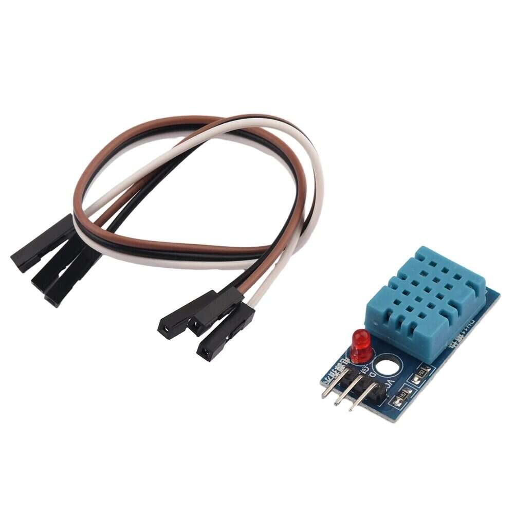
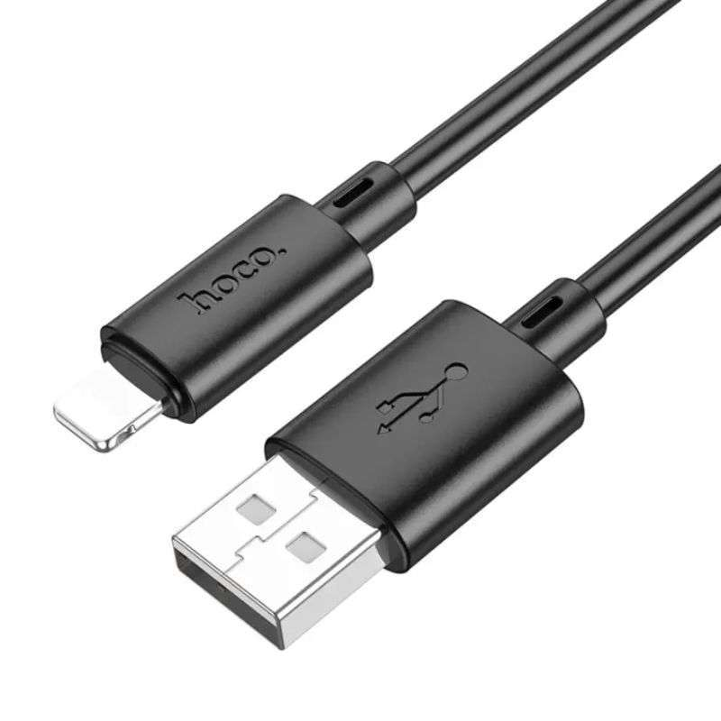
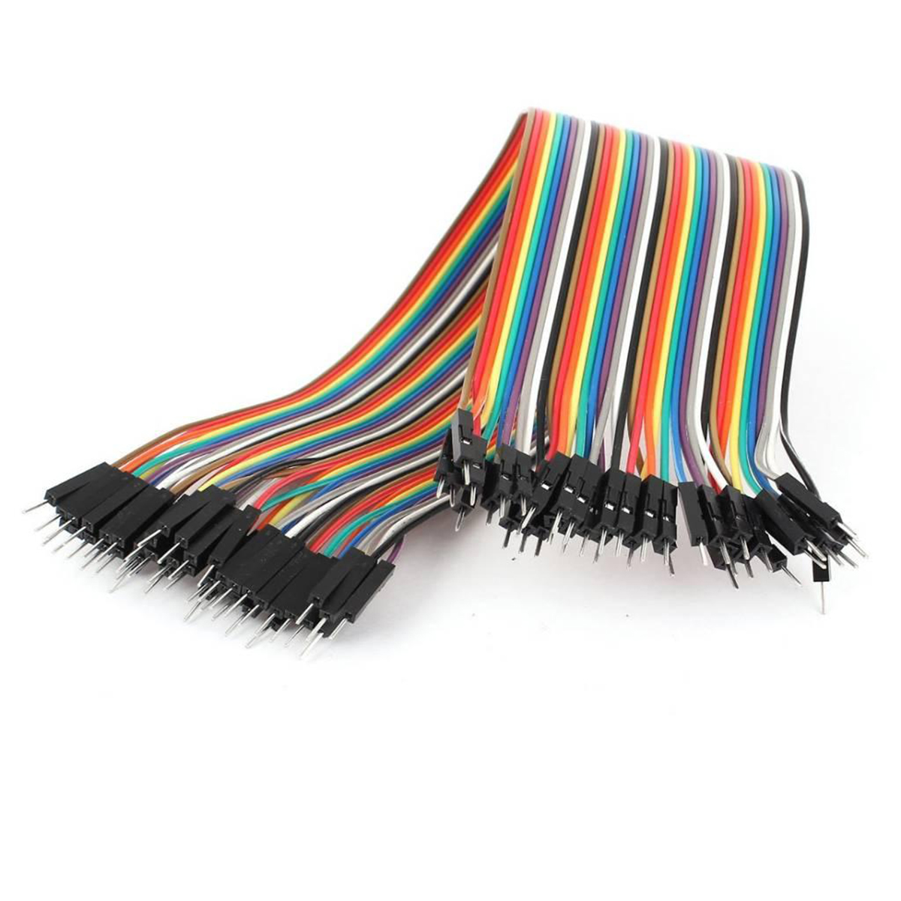

# 🌡️ Temperature-Based Fan Speed Control Project

A temperature-controlled fan system that automatically adjusts the fan speed based on the environment using Arduino and DHT11 sensor. The system also displays the current temperature and humidity on a 16x2 LCD.

---

## 🛠️ Equipment List

- Arduino UNO  
- L298N Motor Driver  
- DC Motor  
- 16x2 LCD Display (I2C)  
- Breadboard  
- DHT11 Temperature Sensor  
- Jumper Wires  
- USB Cable for Arduino  

---

## 🎯 Objective

To create a smart cooling system that:

- Reads ambient temperature and humidity via a DHT11 sensor  
- Displays temperature data on an LCD screen  
- Controls a DC motor's speed using the L298N module based on real-time temperature  

---

## 🧠 How It Works (In Operating System)

1. **Sensing**: The DHT11 sensor detects temperature and humidity.
2. **Processing**: Arduino calculates and decides the speed level.
3. **Display**: The LCD shows current temperature and humidity.
4. **Action**: L298N controls the fan speed depending on temperature range.

---

## ⚙️ How to Set Up

> 🧑‍💻 Follow this simple guide to get your project running:

### 🔍 Step 1: Check the LCD I2C Address

- Open `LCD_SCanner.ino` in Arduino IDE.
- Install I2C library:  
  `Sketch > Include Library > Add .ZIP Library`  
  Select `Arduino-LiquidCrystal-I2C-library-master.zip`
- Upload the code and check the I2C address (e.g., `0x27`)

### 🧑‍🔧 Step 2: Upload Main Code

- Open `Code_Temp_Ctrl_Emandir.ino`
- Go to `Sketch > Include Library > Manage Libraries`
  - Install **Adafruit Unified Sensor**
  - Install **DHT Sensor Library**
- Replace the I2C address if needed:
  ```cpp
  LiquidCrystal_I2C lcd(0x27, 16, 2);


## Circuit Diagram


## Project Snapshot


## Equipment
- Arduino UNO  
  

- LCD 16x2  
  

- L298N Motor Driver  
  

  - DHT11 Temperature Sensor
  


- Cable  
  


- Wire 



